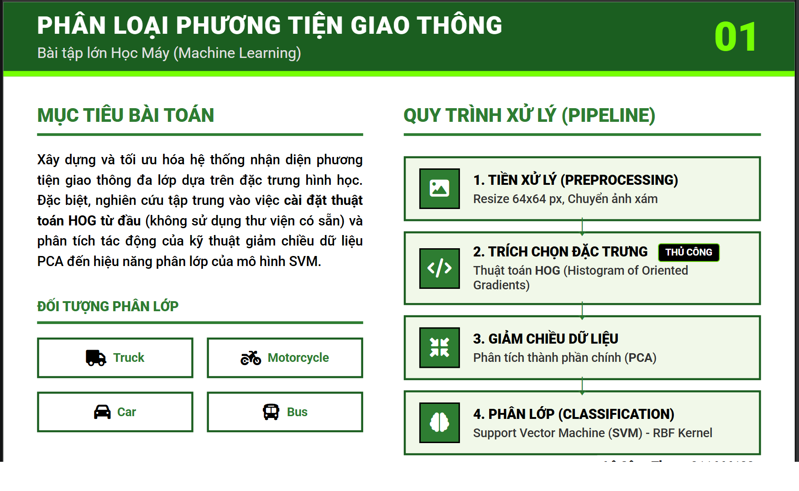
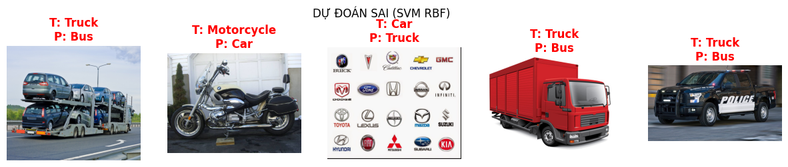
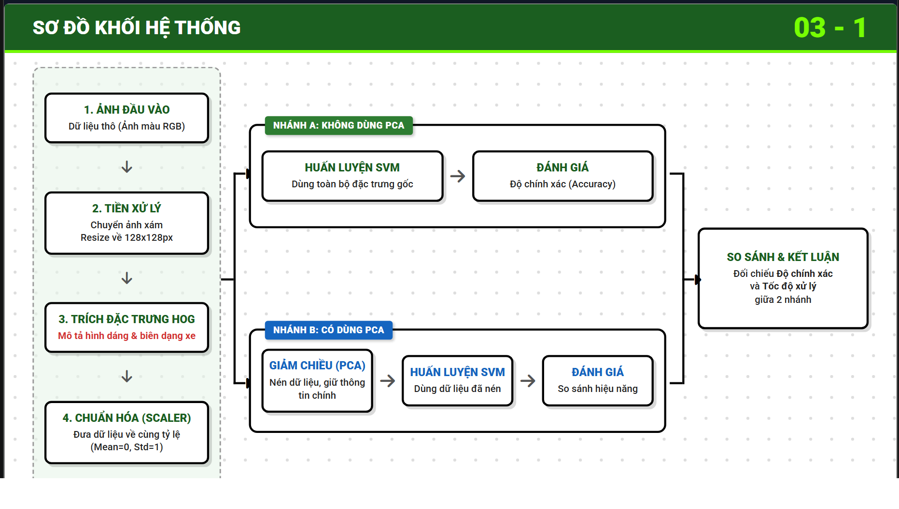
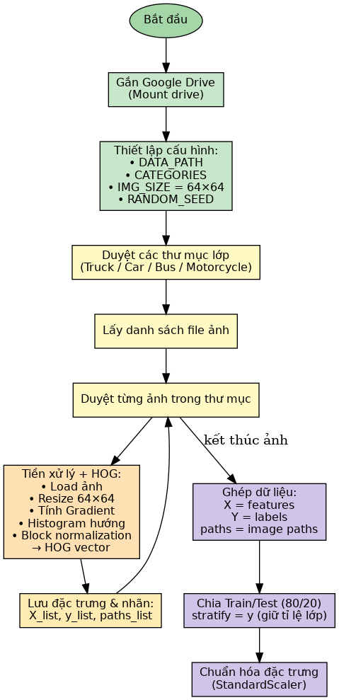
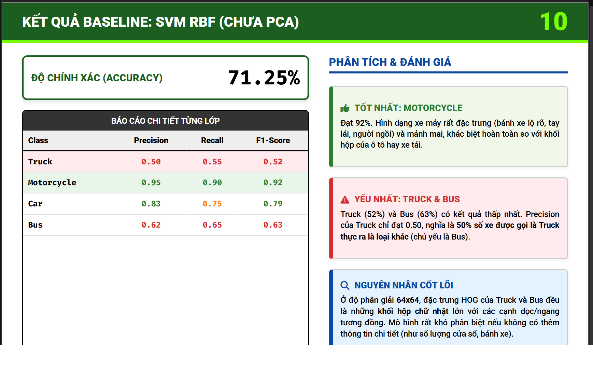
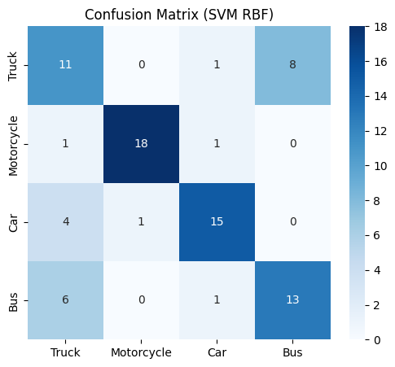
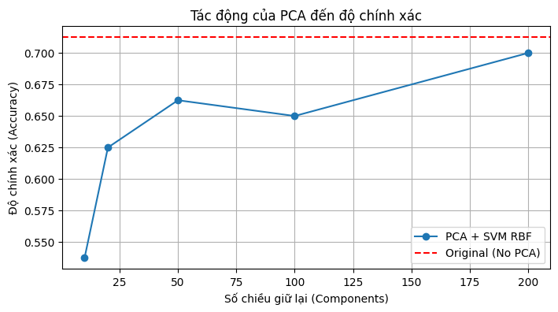
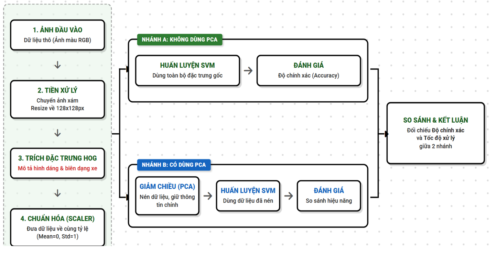
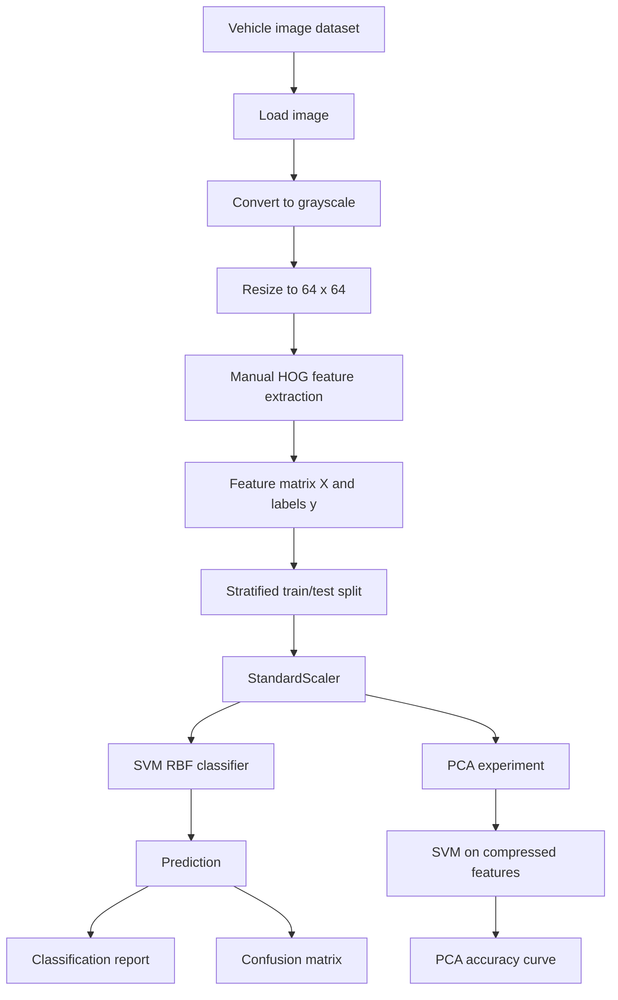

<a id="readme"></a>
<a href="#readme"></a>

# Vehicle Classification with HOG, SVM RBF and PCA

> Classical computer vision pipeline for classifying Truck, Motorcycle, Car, and Bus images.

<a href="#readme"></a>
<a href="#readme"></a>
<a href="#readme"></a>
<a href="#readme"></a>
<a href="#readme"></a>
<a href="LICENSE"></a>

## <a name="table-of-contents"></a> Table of Contents

- [Overview](#overview)
- [At a Glance](#at-a-glance)
- [Visual Preview](#visual-preview)
- [Project Highlights](#project-highlights)
- [Results & Metrics](#results)
- [Report Insights](#report-insights)
- [Features](#features)
- [Tech Stack](#tech-stack)
- [Pipeline Architecture](#architecture)
- [Methodology](#methodology)
- [Quick Start](#quick-start)
- [Project Structure](#project-structure)
- [Dataset Format](#dataset-format)
- [Reproducibility](#reproducibility)
- [Data Policy](#data-policy)
- [Troubleshooting](#troubleshooting)
- [Author](#author)
- [License](#license)

## <a name="overview"></a> Overview

This project implements a traditional machine learning approach for vehicle image classification. Instead of using a deep learning model, the pipeline extracts handcrafted HOG features from vehicle images, standardizes the feature vectors, trains an SVM classifier with an RBF kernel, and analyzes the effect of PCA dimensionality reduction.

The project was implemented in Google Colab as a Jupyter Notebook and evaluated on a 4-class dataset:

- Truck
- Motorcycle
- Car
- Bus

The report positions this problem as a basic module for Intelligent Transportation Systems (ITS), where vehicle classification can support traffic counting, density estimation, abnormal behavior detection, and smart traffic management.

## <a name="at-a-glance"></a> At a Glance

| Item | Detail |
|---|---|
| Problem | 4-class vehicle image classification |
| Approach | Manual HOG features + StandardScaler + SVM RBF |
| PCA role | Dimensionality-reduction experiment, not the final baseline |
| Dataset size | 400 images, 100 images per class |
| Evaluation split | 80/20 stratified train-test split |
| Best recorded accuracy | 71.25% without PCA |
| Main learning value | Classical CV feature engineering and ML evaluation workflow |

## <a name="visual-preview"></a> Visual Preview

| Project overview | Dataset and samples |
|---|---|
|  |  |

| Processing pipeline | Algorithm flowchart |
|---|---|
|  |  |

| Baseline result | Confusion matrix |
|---|---|
|  |  |

| PCA accuracy curve | System block diagram |
|---|---|
|  |  |

## <a name="project-highlights"></a> Project Highlights

- Implemented a manual HOG feature extractor to understand gradient, histogram voting, cell, block, and L2 normalization steps.
- Built a full data pipeline: image loading, grayscale conversion, resizing, HOG extraction, train/test split, and standardization.
- Trained an SVM classifier with an RBF kernel for 4-class vehicle classification.
- Applied PCA to test the trade-off between feature dimensionality and classification accuracy.
- Visualized confusion matrix, PCA accuracy curve, correct predictions, and wrong predictions.
- Compared baseline HOG + SVM performance against PCA-compressed variants.
- Documented model limitations and class-level errors so the project reads as an experiment, not just a notebook run.

## <a name="results"></a> Results & Metrics

**Google XYZ summary:** Achieved **71.25% test accuracy**, measured on an **80-image stratified test set**, by implementing **manual HOG feature extraction, StandardScaler preprocessing, and an SVM RBF classifier**.

| Item | Value |
|---|---:|
| Classes | 4 |
| Images per class | 100 |
| Total images | 400 |
| Train split | 320 images |
| Test split | 80 images |
| Image size | 64 x 64 |
| HOG feature length | 1764 |
| Baseline model | SVM RBF |
| Baseline accuracy | 71.25% |

### Classification Report

| Class | Precision | Recall | F1-score | Support |
|---|---:|---:|---:|---:|
| Truck | 0.50 | 0.55 | 0.52 | 20 |
| Motorcycle | 0.95 | 0.90 | 0.92 | 20 |
| Car | 0.83 | 0.75 | 0.79 | 20 |
| Bus | 0.62 | 0.65 | 0.63 | 20 |
| **Accuracy** |  |  | **0.71** | **80** |

### PCA Experiment

| PCA components | Accuracy |
|---:|---:|
| 10 | 53.75% |
| 20 | 62.50% |
| 50 | 66.25% |
| 100 | 65.00% |
| 200 | 70.00% |
| No PCA | 71.25% |

PCA reduced the feature dimension substantially, but the original 1764-dimensional HOG features produced the best accuracy in this experiment.

## <a name="report-insights"></a> Report Insights

### Problem Scope

- Input images are assumed to already contain a cropped vehicle region.
- The system classifies images into `Bus`, `Car`, `Motorcycle`, and `Truck`.
- The project does not perform real-time video detection.
- The project intentionally uses a classical ML pipeline instead of CNN/deep learning.

### Why HOG + SVM RBF?

HOG is suitable because the task is shape-based: vehicle classes differ mainly by body outline, edge orientation, and structural geometry. SVM RBF was selected because HOG feature vectors are high-dimensional and not linearly separable, especially for visually similar classes such as Truck and Bus.

### PCA Conclusion

The report concludes that PCA should **not** be used in the final baseline configuration for this dataset:

- Baseline without PCA achieved **71.25% accuracy**.
- PCA with 200 components reached **70.00% accuracy**.
- Lower PCA dimensions removed important shape details from HOG features.
- Truck and Bus became harder to separate after dimensionality reduction.

### Error Analysis

The strongest class was `Motorcycle` with **92% F1-score**. The weakest classes were `Truck` and `Bus`, mainly because both have large rectangular shapes at `64 x 64` resolution. HOG captures global edge structure well, but fine details such as windows, doors, and wheel positions become less visible at low resolution.

### Future Improvements

- Increase image resolution from `64 x 64` to `128 x 128`.
- Tune SVM hyperparameters with grid search.
- Add more training images, especially for Truck and Bus.
- Compare the classical HOG + SVM pipeline with a lightweight CNN model.

## <a name="features"></a> Features

- Manual HOG implementation from image gradients to normalized block descriptors.
- 4-class vehicle dataset loading from Google Drive folder structure.
- Stratified 80/20 train-test split.
- Feature scaling with `StandardScaler`.
- SVM RBF classifier with balanced class weights.
- PCA dimensionality reduction experiment.
- Confusion matrix visualization with Seaborn.
- Correct/wrong prediction visualization.

## <a name="tech-stack"></a> Tech Stack

<a href="#tech-stack"></a>

| Area | Technologies |
|---|---|
| Language | Python |
| Notebook | Jupyter Notebook, Google Colab |
| Image Processing | PIL, OpenCV, NumPy |
| Machine Learning | scikit-learn, SVM RBF, PCA, StandardScaler |
| Visualization | Matplotlib, Seaborn |

## <a name="architecture"></a> Pipeline Architecture



## <a name="methodology"></a> Methodology

### Manual HOG

The notebook implements HOG manually with these steps:

1. Convert the image to grayscale.
2. Resize to `64 x 64`.
3. Compute horizontal and vertical gradients.
4. Convert gradients to magnitude and angle.
5. Vote gradient magnitudes into 9 orientation bins per cell.
6. Normalize neighboring cell histograms in blocks.
7. Return a 1764-dimensional HOG feature vector.

### SVM RBF

The baseline classifier uses:

```python
SVC(kernel="rbf", C=10, gamma="scale", class_weight="balanced", random_state=42)
```

### PCA Analysis

PCA was tested with:

```text
10, 20, 50, 100, 200 components
```

The goal was to observe how dimensionality reduction affects SVM accuracy.

## <a name="quick-start"></a> Quick Start

### 1. Install dependencies

```powershell
pip install -r requirements.txt
```

### 2. Prepare dataset

Create a dataset folder with this structure:

```text
Dataset vehicle/
├── Truck/
├── Motorcycle/
├── Car/
└── Bus/
```

Each class folder should contain image files such as `.jpg`, `.jpeg`, or `.png`.

### 3. Open notebook

Open the notebook in Jupyter or Google Colab:

```text
(ipynb) Vehicle_Hog_SVMRBF_PCA.ipynb
```

If running outside Google Colab, replace:

```python
DATA_PATH = "/content/drive/MyDrive/Dataset vehicle"
```

with your local dataset path.

## <a name="project-structure"></a> Project Structure

```text
.
├── (ipynb) Vehicle_Hog_SVMRBF_PCA.ipynb # Main experiment notebook
├── docs/
│   └── images/                          # README visuals extracted from notebook/report/slides
├── README.md                           # GitHub project documentation
├── requirements.txt                    # Python dependencies
└── .gitignore                          # Local/cache exclusions
```

## <a name="dataset-format"></a> Dataset Format

The notebook expects four class folders:

| Folder | Label |
|---|---|
| `Truck` | Truck |
| `Motorcycle` | Motorcycle |
| `Car` | Car |
| `Bus` | Bus |

The experiment output recorded:

```text
Truck: 100 images
Motorcycle: 100 images
Car: 100 images
Bus: 100 images
```

## <a name="reproducibility"></a> Reproducibility

The main experiment uses:

| Parameter | Value |
|---|---|
| `RANDOM_SEED` | `42` |
| Train/test split | `test_size=0.2`, `stratify=y` |
| Image preprocessing | Grayscale, resize to `64 x 64` |
| HOG configuration | `cell_size=8`, `block_size=2`, `bins=9` |
| Feature scaling | `StandardScaler` fitted on training data only |
| Baseline classifier | `SVC(kernel="rbf", C=10, gamma="scale", class_weight="balanced")` |
| PCA components tested | `10`, `20`, `50`, `100`, `200` |

Because the dataset is not included in this repository, exact results require using the same 400-image dataset described above.

## <a name="data-policy"></a> Data Policy

- The raw dataset is intentionally excluded from Git using `.gitignore` because image ownership and redistribution rights may vary.
- The repository includes only source code, dependency metadata, presentation material, and selected result images for portfolio review.
- If you reuse the notebook, prepare your own dataset with the same folder structure before running the pipeline.

## <a name="troubleshooting"></a> Troubleshooting

| Problem | Suggested fix |
|---|---|
| Dataset path not found | Update `DATA_PATH` to the correct local or Google Drive folder |
| Google Drive mount fails | Run the notebook in Colab and authorize Drive access |
| Notebook runs slowly | Manual HOG loops are intentionally explicit for learning; reduce image count for quick tests |
| `sklearn` import error | Install dependencies with `pip install -r requirements.txt` |
| Low accuracy on new data | Improve dataset size, balance, image quality, or tune SVM/PCA parameters |

## <a name="author"></a> Author

**Le Song Thao**<br>
Engineering degree - Electronics and Telecommunications Engineering<br>
Major: Industrial Electronics and Informatics

## <a name="license"></a> License

Source code in this repository is released under the [MIT License](LICENSE). Please check dataset ownership and licensing before redistributing any vehicle images.

<a href="#readme"></a>
